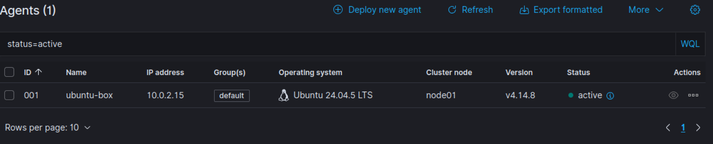
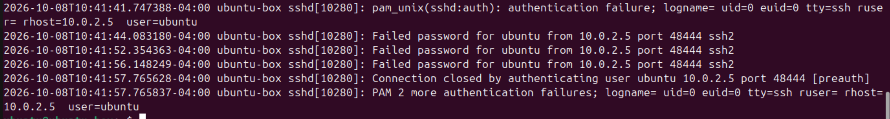
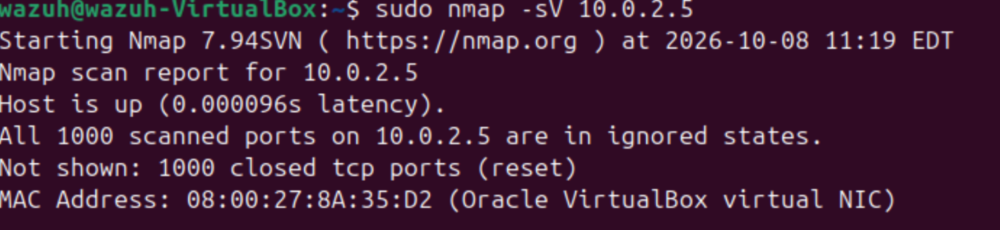
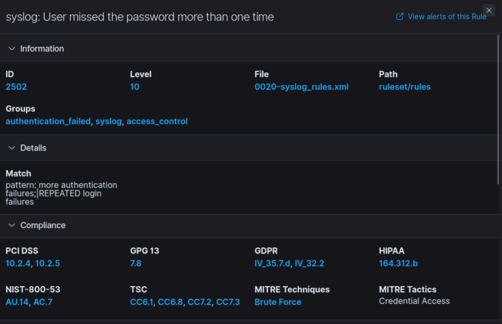
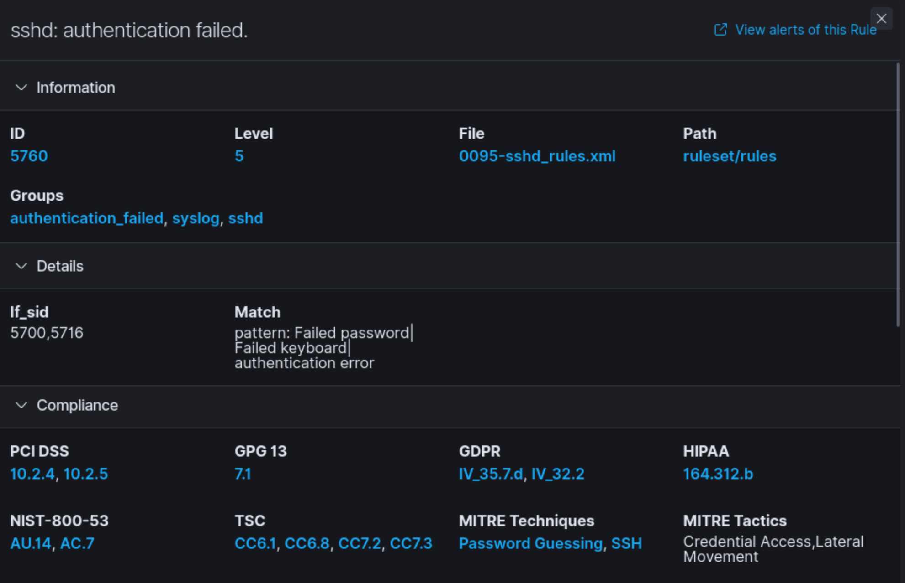

[← Back to Alex's Portfolio](https://github.com/AlexB-128)
# Wazuh SOC Lab
A lab exploring Wazuh's SIEM and XDR capabilities with an emphasis on the detection and analysis phases of an incident response cycle.

## Objective

Configured Wazuh SIEM/XDR server on Ubuntu with Wazuh agent configured on an Ubuntu endpoint. The purpose of this lab was to generate security related events and investigate the triggered alerts. The investigation focused on understanding how Wazuh detects abnormal/malicious activity and how logs can be used in the detection phase of incident response. Kali Linux was used to simulate these attacks on the Ubuntu endpoint. 

## Lab Environment

- Wazuh Server -> SIEM/XDR Server
- Endpoint -> Monitored Endpoint
- Wazuh Agent -> Sends endpoint data to server
- Kali -> Attacker Machine

# Investigation

### Observations

- An Nmap scan of TCP/22 did not generate a Wazuh security alert.
- An SSH connection attempt alone didn't generate a Wazuh security alert; failed authentication attempts generated multiple alerts.
     
### Actions Taken
- Reviewed and confirmed events with endpoint's /var/log/auth.log and /var/log/syslog as positive.
  
- The failed login appears to be coming from a IP 10.0.2.5.
- After discovering the IP I chose to investigate further and used Nmap to fingerprint the device, all ports appear to be in ignore states but the MAC address 08:00:27:8A:35:D2 was discovered.
   
### Conclusion
- This source device is currently unidentified and should be investigated further to determine whether it is authorized on the network.

## Generated Alerts

The attacker machine was used to launch an SSH Brute Force attack against the Ubuntu endpoint.  

- "sshd: authentication failed" (x3) - information pulled from /var/log/auth.log on Ubuntu Endpoint
Rule Level: 5 
MITRE Techniques: Password Guessing, SSH
MITRE Tactics: Credential Access, Lateral Movement

- "syslog: User missed the password more than one time"
Rule Level: 10
MITRE Techniques: Brute Force
MITRE Tactics: Credential Access

- "PAM: User login failed." 
Rule Level: 5
MITRE Techniques: Password Guessing
MITRE Tactics: Credential Access

